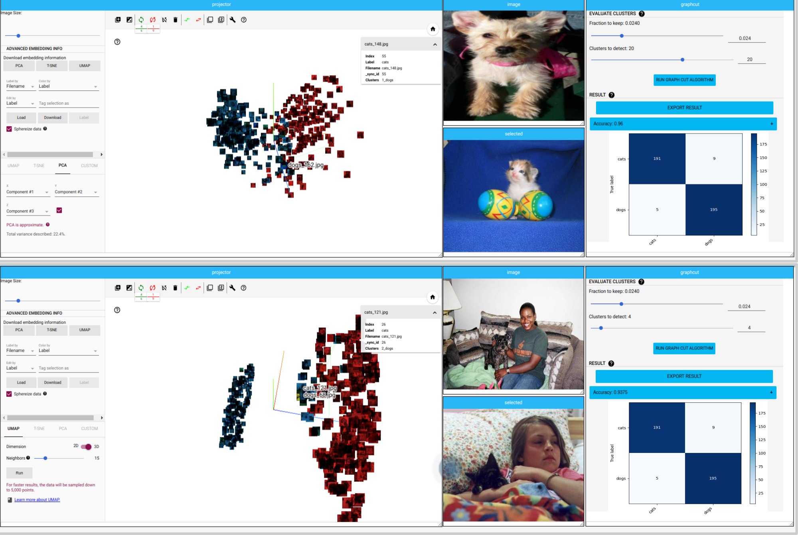

# NIPGBoard origin Tensorboard

NipgBoard is a customized iteration of Tensorboard, specifically tailored for the purpose of unsupervised image classification. It incorporates advanced deep clustering technologies to enable swift and effective image annotations. The user-friendly interface empowers users to manually or automatically annotate images based on positive or negative associations between pairs of objects.

This tool is designed to facilitate the training of deep clustering algorithms, providing a comprehensive solution for image classification tasks. With its intuitive features and capabilities, NipgBoard streamlines the process of image annotation and enhances the overall efficiency of unsupervised image classification workflows.

## Samples



## Prerequisites

Ensure that you fulfill the following prerequisites before attempting to install, build, and run NIPGBoard:
* Operating System: NIPGBoard has been developed and tested on Ubuntu 20.04 and 18.04. Hence, we highly recommend using this version for the installation and building process on the server side.

* TMUX: It is advisable to have TMUX installed on the server side and run NIPGBoard within a TMUX terminal. TMUX terminal creates a host server on your Linode and connects to it with a client window. This setup ensures that even if the client gets disconnected, the server will continue to run without interruptions.

* Browser Compatibility: The front-end features of NIPGBoard are optimized for usage in Chrome or Chromium browsers. While some functionalities may work inconsistently or be unstable in other browsers, using Chrome or Chromium will provide the best experience.

* GPU Acceleration: If you intend to perform GPU-accelerated training using the supported TensorFlow version, please make sure you have Cuda 10.0 installed on your computer. This is a prerequisite for leveraging the full capabilities of NIPGBoard. Newer CUDA versions may be used. However, some issues might arise from this change.

* Singularity: The installation of Singularity is necessary for setting up the required environment to run NIPGBoard effectively. Ensure that Singularity is properly installed and configured on your system.

* Image Clustering: When performing the image clustering task, please use RGB images instead of RGBA. However, if you have RGBA images available, the tutorial will provide instructions on how to handle them during the data generation process.

By meeting these requirements, you will be well-prepared to proceed with the installation, building, and utilization of NIPGBoard.

## Dependencies and Setup
To ensure the successful execution of any training algorithms in NIPGBoard, it is essential to have Cuda 10.0 installed on your device for GPU compatibility. Please note that the installation process for Cuda 10.0 is not covered in this guide.
To begin, follow the steps below to run the selenium environment. The environment image is included in the repository, either available in Bitbucket or as part of a release package.
* Open a terminal and enter the following command to access the singularity shell:  
```
singularity shell library://csgergo/default/nipgselenium
```

*After downloading the repository, run the setup script by executing the following commands:

```
chmod +x setup.sh
./setup.sh
```

Please note the following important information:
*The install script is executed with the "--user" flag, so it is important to ensure that the user pip package directory is included in your PATH. You can achieve this by adding the following line to your ~/.bashrc file:
```
export PATH="${PATH}:/${HOME}/.local/bin"
```


If you encounter an error during the build process that mentions your Bazel cache folder, which may occur if you have previously built a different version of NIPGBoard, you can resolve this error by running the following command:

```
bazel clean --expunge
```

By following these instructions, you will be ready to proceed with running the NIPGBoard environment and executing training algorithms effectively.

## Setting up a data directory (logdir)
We provide a logdir generation script for your convenience, which allows you to generate the necessary directory structure. However, it requires specific modifications based on various components such as data splits, algorithm paths, embedding names, and maximum epochs for each algorithm specific to your dataset. To ensure proper configuration, please follow the steps outlined below for making the required adjustments:

* Locate the logdir genertation script provided in the repository.

* Look for the placeholders or variables within the logdir that represent the dataset data splits. These variables might be named according to the specific dataset used.

* Modify the placeholders or variables in the logdir with the correct paths or names corresponding to your dataset data splits. Ensure that the logdir reflects the actual file locations and naming conventions used for your dataset.

* Save the modified logdir with a descriptive name or a naming convention that helps identify the dataset and data splits it represents.

* Add the required data splits (train, test) dirs to the, the dirs name should correspond to the ones provided in the template. 


By making these appropriate modifications to the logdir template, you will have a customized logdir configuration that aligns with your specific dataset and data splits. This will enable accurate tracking and organization of your training results within NIPGBoard.
## Run
To run NIPGBoard with a specific logdir (data folder) in the terminal, please follow the commands provided below:

To run NIPGBoard:
```
$ ./run.sh /absolute/path/to/logdir/
```
After executing the appropriate command, a URL will be displayed in the terminal where NIPGBoard is hosted. It will typically appear as "localhost:port" or similar.

To ensure that NIPGBoard continues running even after you close the terminal, it is recommended to use a TMUX terminal. The following commands demonstrate how to set up a TMUX session:

```
$ tmux new -s my_session_name
$ ./run.sh /absolute/path/to/logdir/
$ Ctrl+b d
```

To manage your TMUX session effectively, consider the following important commands:
To terminate the TMUX session:

```
$ tmux kill-session -y my_session_name
```

To reattach to a TMUX session:

```
$ tmux attach-session -t my_session_name
```
By following these instructions, you will be able to run NIPGBoard with the desired logdir and utilize TMUX for a seamless experience. Alternatively, you can use the 'screen' command.